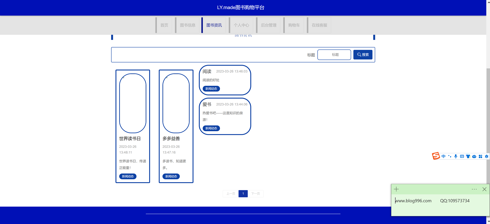
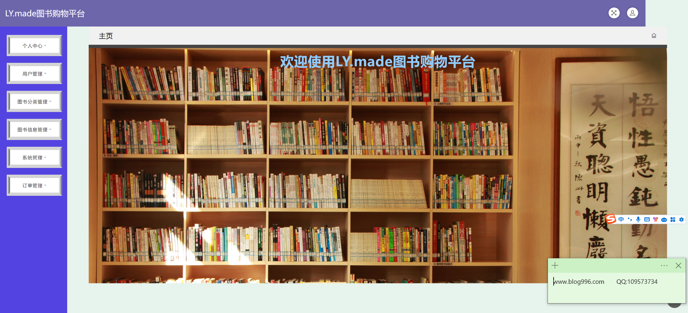

<h1 align="center">图书购物管理系统</h1>

## 简介
图书购物管理系统：角色分为管理员、用户；功能包括购物车管理、个人信息管理、图书搜索与资讯浏览、在线客服和订单管理，支持用户登录注册，界面设计简洁以提升用户体验。    --计算机毕业设计源码；毕设源码；java毕业设计源码

## 联系方式

<h3 align="center">获取完整代码与数据库文件 + 微信：bysj5151 QQ: 86050149 QQ群: 783742310</h3>

<h3 align="center">可帮忙远程部署 包运行成功！提供远程部署、修改代码、设计文档指导、代码讲解等服务！</h3>

## 功能介绍（完整见运行截图）
管理员：登录、注册、用户管理、图书分类管理、图书信息管理、系统管理及订单管理，导航栏提供访问主页、图书信息、图书资讯、个人中心和后台管理的快捷方式；可以查看、修改、和删除书籍信息并支持批量删除操作，以高效管理图书和用户数据。

用户：登录、注册、查看与修改个人信息，通过导航栏访问主页、图书信息、图书资讯、个人中心和购物车；可以进行图书搜索、查看图书详情、添加书籍至购物车，调整书籍数量并购买结算，包含订单查询、地址管理、收藏的个人中心功能。

## 运行截图

本代码来源于网络,仅供学习参考使用!

